# vrm-rigify

Generate Blender Rigify armatures for VRM models.

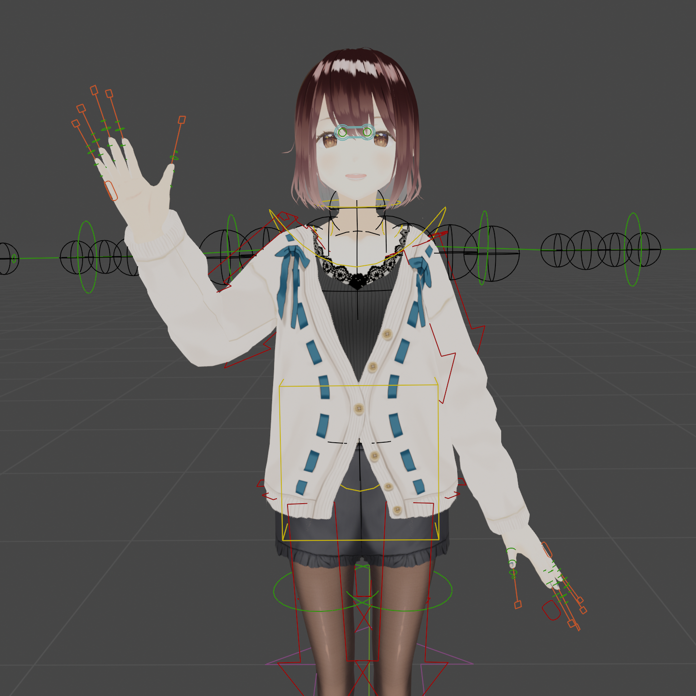

## Notice

This addon has been tested with [VRoid's sample avatars](https://vroid.pixiv.help/hc/en-us/articles/4402394424089) and
only supports the VRM 0.x format.

## Installation

1. Download `vrm_rigify.zip` from the releases page.
2. Install [VRM Add-on for Blender](https://vrm-addon-for-blender.info/en/) if it is not already installed.
3. Open Blender and go to `Edit` > `Preferences` > `Add-ons`:

   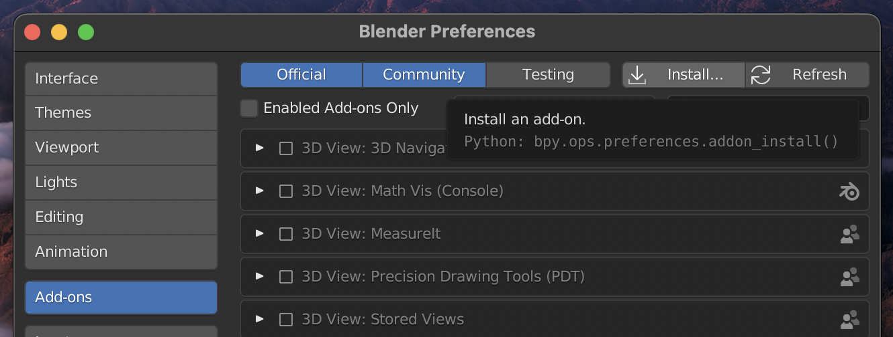

4. Click on `Install...` and select `vrm_rigify.zip`.
5. Check the box next to the addon to enable it:

   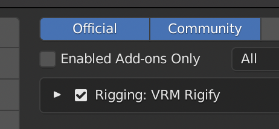

6. In the same `Blender Preferences` window, go to `Interface`.
7. Check the box labelled `Developer Extras`. This is necessary to show the addon's commands in Blender's operator
   search menu:

   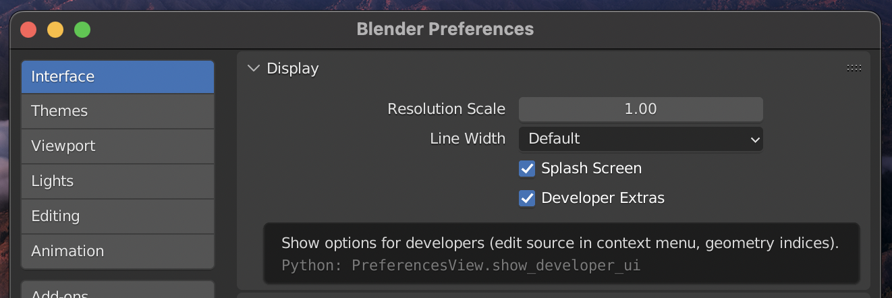

## Usage

### Generating the Rigify armature

1. Import a VRM model by going to `File` > `Import` > `VRM`:

   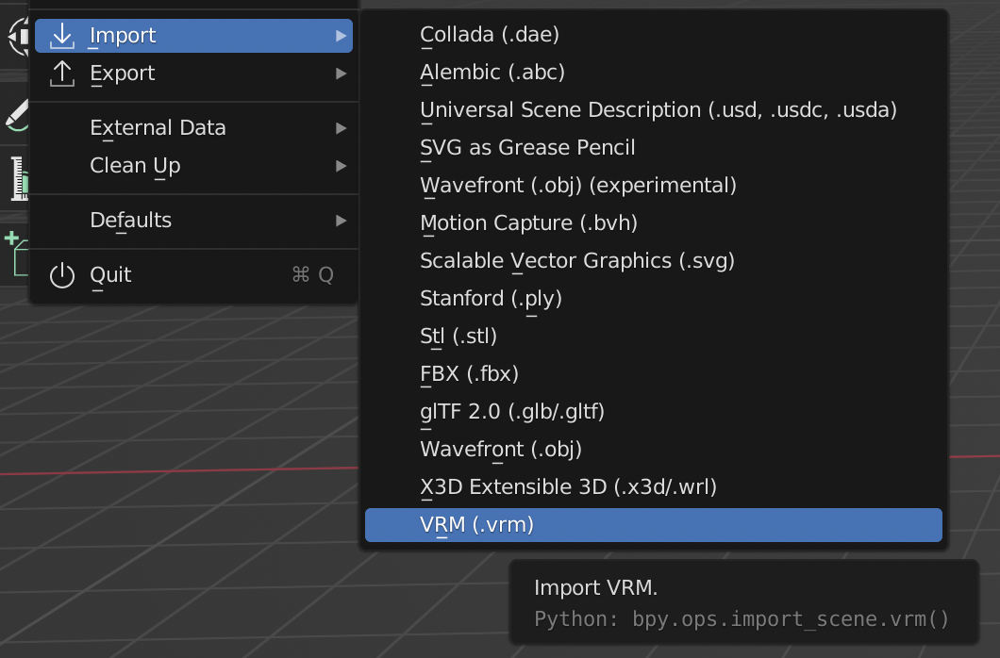

2. Select the imported armature object in the outliner:

   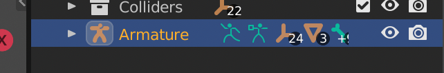

3. Go to `Edit` > `Operator Search...` or press `F3`:

   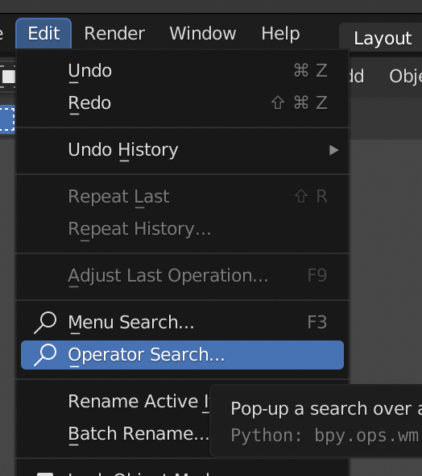

4. Search for `Generate Humanized VRM Rig` and press `Enter`:

   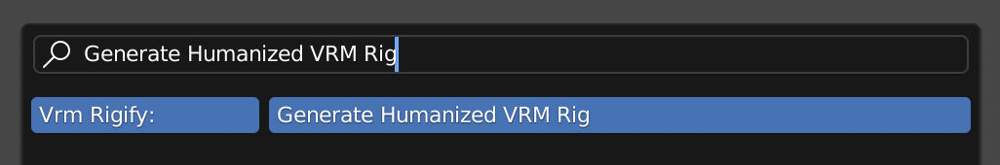

5. The Rigify armature has now been generated! It will appear as `Armature.rig` in the outliner:

   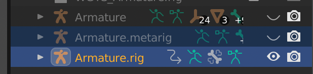

   Note that location of `Armature.rig` and `Armature.metarig` in the outliner may differ depending on the last selected
   collection.

### Parenting the meshes to the armature

1. Expand the (now hidden) imported armature object and select the meshes inside it:

   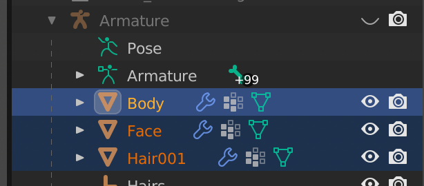

2. While the meshes are selected, select the generated `Armature.rig` Rigify armature.
3. Right click and select `Parent` > `Armature Deform`:

   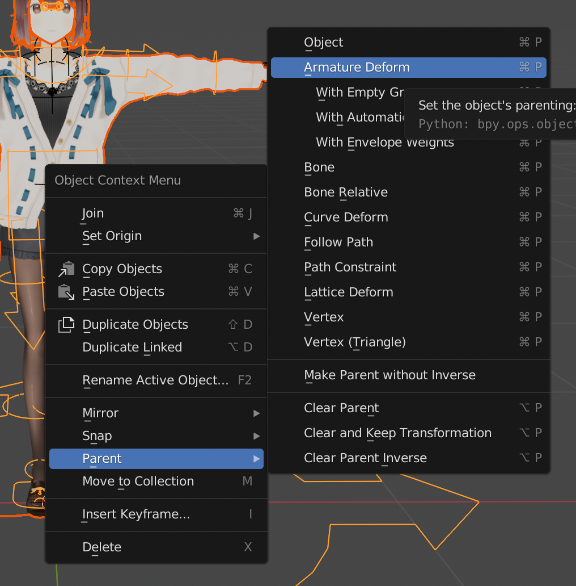

4. The meshes are now bound to the Rigify armature! You can pose the model by entering `Pose Mode`:

   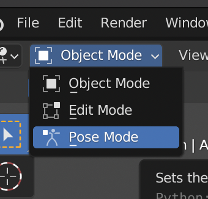

5. (Optional) Remove any objects that are no longer needed:

   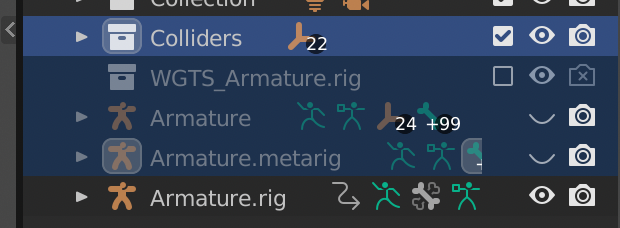
